<div align="center">
  
</div>

# Rev_Shell

> Reverse shell payload generator — authorized use only.

Generates reverse shell one-liners for a target host and port across a range of
interpreters and utilities, so you are not hunting for the right syntax mid-engagement.

## Usage

```bash
python shell.py
```

Pick a payload type from the menu, then supply the listener host and port.

## Supported payloads

`Python` · `Bash` · `Sh` · `PowerShell` · `Netcat (nc)` · `PHP` · `Ruby` · `Perl` · `Ncat (Nmap)` · `Socat` · `Java`

## Disclaimer

> **Authorized security testing only.** Use this against systems you own or have
> written permission to test.

## Author

**Omar Khalid** — [omareldemery.com](https://omareldemery.com) | [@amooryx](https://github.com/amooryx)
